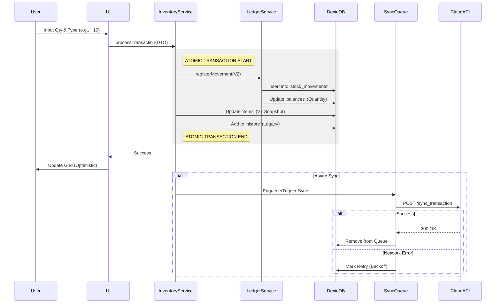

# 02-FLOW.md (Logic Map)

## 1. Core Transaction Flow (Stock Movement)
This flow represents a user executing an "Entry", "Exit", or "Adjustment".



## 2. Synchronization Strategy (Smart Merge)
This flow describes how the application syncs with the Cloud (Google Sheets) on startup.

```mermaid
graph TD
    A[Start App] --> B{Online?}
    B -- No --> C[Load Local Dexie Data]
    B -- Yes --> D[Fetch Cloud Data (GET read_full_db)]

    D --> E[Receive Data (Catalog, Batches, Balances)]
    E --> F[Check SyncQueue]

    F -- Queue NOT Empty --> G[Push Pending Changes First]
    G --> D

    F -- Queue Empty --> H[Start Smart Merge]

    subgraph Smart Merge Logic
        H --> I{Item exists Locally?}
        I -- Yes --> J[Update Quantity from Cloud]
        I -- No --> K[Insert New Cloud Item]
        J --> L[Preserve Local 'Dirty' Flags]
    end

    L --> M[Commit to Dexie]
    K --> M
    M --> N[Render UI]
```

## 3. Error Handling & Resilience

### A. Transaction Failures
*   **Validation Error:** Thrown immediately (e.g., "Negative Stock"). UI shows Toast.
*   **Storage Error (Quota Exceeded):** `db.transaction` aborts. No data is corrupted. User alerted to clear space.

### B. Sync Failures
*   **Network Timeout (GAS):**
    1.  `SyncQueueService` catches error.
    2.  Increments `retryCount`.
    3.  Schedules retry in `2^n` seconds.
*   **Data Conflict (Server Rejected):**
    1.  Log error to `systemLogs` table.
    2.  Mark queue item as `FAILED`.
    3.  Notify User: "Erro na sincronização. Contate Suporte."

### C. Data Drift (V1 vs V2)
*   **Detection:** `InventoryService.runLedgerAudit()` runs on idle/startup.
*   **Logic:**
    1.  Sum `balances` where `batchId = X`.
    2.  Compare with `items` quantity.
    3.  If `diff > 0`, Auto-update `items` quantity.
```